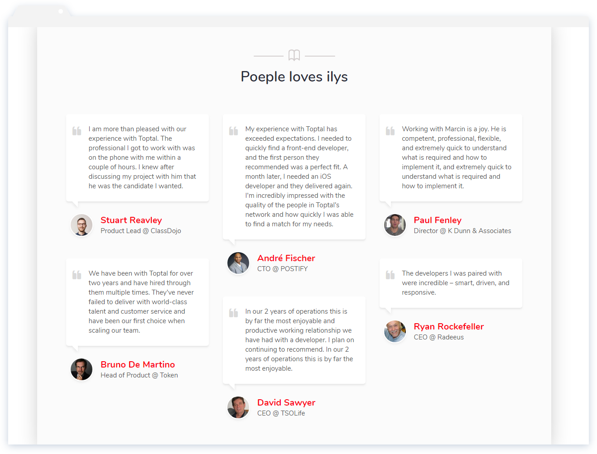

# Smart Cards

• This page created on Jun 4, 2018.

It's a part of my Front-end web development daily practice.

I started on May 31, 2018.

I'm practising since 5 days and counting to reach my goal: 1111 days (3 years) of daily practice.

Twitter: @ahmedhosna95

• UI Design from [dribbble](https://dribbble.com/shots/3385948-Smart-Cards/attachments/737893), I got it in order to implement it in HTML & CSS.

# HTML/CSS Result - [Live Preview](https://cdn.rawgit.com/ahmedhosna95/Front-end-Daily-Practice/151e17f6/Day006/smart_cards/index.html)

